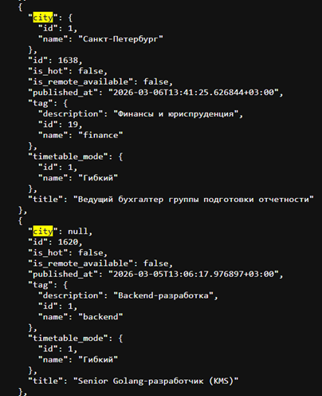
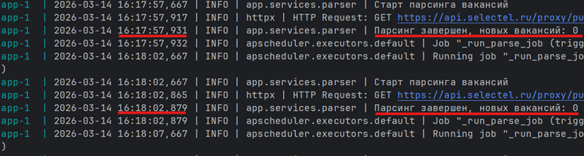
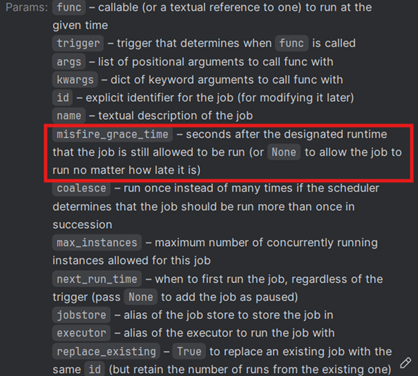
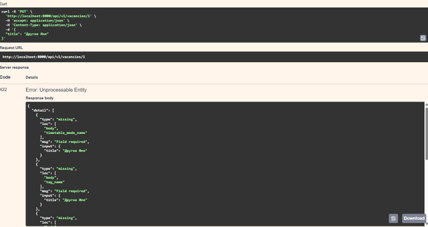
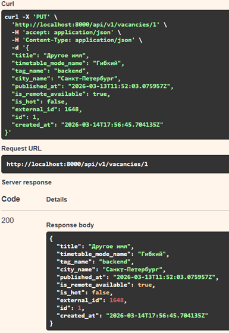
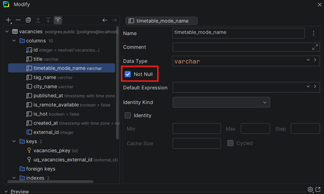

Тестовое задание по направлению «Backend-разработка. Python»

# Отчет по откладке приложения Габриелян Александр Эдуардович

## Анализ и запуск (Баг №1)

**Что сделал:** Запустил контейнер 'docker compose up' и получил:
```
app-1 | Traceback (most recent call last):

app-1 | File "/usr/local/bin/alembic", line 8, in &lt;module&gt;

app-1 | sys.exit(main())

app-1 | ^^^^^^

app-1 | File "/usr/local/lib/python3.11/site-packages/alembic/config.py", line 1047, in main

app-1 | CommandLine(prog=prog).main(argv=argv)

app-1 | File "/usr/local/lib/python3.11/site-packages/alembic/config.py", line 1037, in main

app-1 | self.run_cmd(cfg, options)

app-1 | File "/usr/local/lib/python3.11/site-packages/alembic/config.py", line 971, in run_cmd

app-1 | fn(

app-1 | File "/usr/local/lib/python3.11/site-packages/alembic/command.py", line 483, in upgrade

app-1 | script.run_env()

app-1 | File "/usr/local/lib/python3.11/site-packages/alembic/script/base.py", line 545, in run_env

app-1 | util.load_python_file(self.dir, "env.py")

app-1 | File "/usr/local/lib/python3.11/site-packages/alembic/util/pyfiles.py", line 116, in load_python_file

app-1 | module = load_module_py(module_id, path)

app-1 | ^^^^^^^^^^^^^^^^^^^^^^^^^^^^^^^

app-1 | File "/usr/local/lib/python3.11/site-packages/alembic/util/pyfiles.py", line 136, in load_module_py

app-1 | spec.loader.exec_module(module) # type: ignore

app-1 | ^^^^^^^^^^^^^^^^^^^^^^^^^^^^^^^

app-1 | File "&lt;frozen importlib.\_bootstrap_external&gt;", line 940, in exec_module

app-1 | File "&lt;frozen importlib.\_bootstrap&gt;", line 241, in \_call_with_frames_removed

app-1 | File "/app/alembic/env.py", line 8, in &lt;module&gt;

app-1 | from app.core.config import settings

app-1 | File "/app/app/core/config.py", line 20, in &lt;module&gt;

app-1 | settings = Settings()

app-1 | ^^^^^^^^^^

app-1 | File "/usr/local/lib/python3.11/site-packages/pydantic_settings/main.py", line 242, in \_\_init\_\_

app-1 | super().\__init_\_(\*\*\__pydantic_self_\_._\_class_\_.\_settings_build_values(sources, init_kwargs))

app-1 | File "/usr/local/lib/python3.11/site-packages/pydantic/main.py", line 250, in \_\_init\_\_

app-1 | validated_self = self.\__pydantic_validator_\_.validate_python(data, self_instance=self)

app-1 | ^^^^^^^^^^^^^^^^^^^^^^^^^^^^^^^^^^^^^^^^^^^^^^^^^^^^^^^^^^^^^^^^^^^^^

app-1 | pydantic_core.\_pydantic_core.ValidationError: 1 validation error for Settings

app-1 | database_url

app-1 | Extra inputs are not permitted \[type=extra_forbidden, input_value='postgresql+asyncpg://pos...stgres@db:5432/postgres', input_type=str\]

app-1 | For further information visit <https://errors.pydantic.dev/2.12/v/extra_forbidden>

app-1 exited with code 1
```
Это ошибка валидации от библиотеки Pydantic.

**Файл и строка:** `app/core/config.py:14`

**Код до:** `validation_alias="DATABSE_URL",`

**Код после:** `validation_alias="DATABASE_URL",`

**Причина:** Класс BaseSettings от Pydantic парсит данные из файла .env (DATABASE_URL, LOG_LEVEL, PARSE_SCHEDULE_MINUTES), ожидает 3 переменные: DATABSE_URL, LOG_LEVEL, PARSE_SCHEDULE_MINUTES; а получает DATABASE_URL, LOG_LEVEL, PARSE_SCHEDULE_MINUTES. Так как по умолчанию он не может получать лишние переменные, программма завершается с ошибкой валидации.

## Баг №2

**Описание проблемы / Причина:** При запуске программы в консоли видна ошибка.
```
app-1 | 2026-03-14 15:46:01,523 | ERROR | app.main | Ошибка фонового парсинга: 'NoneType' object has no attribute 'name'

app-1 | Traceback (most recent call last):

app-1 | File "/app/app/main.py", line 24, in \_run_parse_job

app-1 | await parse_and_store(session)

app-1 | File "/app/app/services/parser.py", line 43, in parse_and_store

app-1 | "city_name": item.city.name.strip(),

app-1 | ^^^^^^^^^^^^^^

app-1 | AttributeError: 'NoneType' object has no attribute 'name'
```
Посмотрев код в файле app/services/parser.py, я изучил как происходит обработка входных данных. Исходя из ошибки видно, что код падает из-за того, что атрибут name = None. Я решил получить посмотреть как выглядит ответ от сервера вручную.



И в коде (app/schemas/external.py:28) написано:

`city: Optional\[ExternalCity\]`

Это значит, что атрибут city может быть None, но код в parser.py это не учитывает, так что нужно добавить проверку на это.

**Файл и строка:** `app/services/parser.py:43`

**Код до:** `"city_name": item.city.name.strip(),`

**Код после:**` "city_name": item.city.name.strip() if item.city else None,`

## Баг №3

**Описание проблемы / Причина:** Код запускается без ошибок, но в логах видно



Хотя в переменной окружения стоит: `PARSE_SCHEDULE_MINUTES=5`

Парсинг происходит каждые 5 секунд, а не 5 минут.

Причина в том, что в файле /app/services/scheduler.py на 13 строчке написано:

`seconds=settings.parse_schedule_minutes,`

Нужно просто заменить seconds на minutes

**Файл и строка:** `/app/services/scheduler.py:13`

**Код до:** `seconds=settings.parse_schedule_minutes,`

**Код после:** `minutes=settings.parse_schedule_minutes,`

## Баг №4

**Описание проблемы / Причина:** В логах видно (`PARSE_SCHEDULE_MINUTES=1` для удобства)
```
app-1 | 2026-03-14 16:32:59,017 | WARNING | apscheduler.executors.default | Run time of job "\_run_parse_job (trigger: interval\[0:01:00\], next run at: 2026-03-14 16:33:55 UTC)" was missed by 0:00:03.706961

app-1 | 2026-03-14 16:33:59,055 | WARNING | apscheduler.executors.default | Run time of job "\_run_parse_job (trigger: interval\[0:01:00\], next run at: 2026-03-14 16:34:55 UTC)" was missed by 0:00:03.745220

app-1 | 2026-03-14 16:34:59,007 | WARNING | apscheduler.executors.default | Run time of job "\_run_parse_job (trigger: interval\[0:01:00\], next run at: 2026-03-14 16:35:55 UTC)" was missed by 0:00:03.697013
```
Это происходит потому что планировщик задач просрочил задачу. За допустимое окно выполнения задачи отвечает параметр misfire_grace_time.



Я посмотрел исходный код планировщика (_apscheduler/schedulers/base.py:909_) и нашел кусок кода:
```
self._job_defaults = {

"misfire_grace_time": asint(job_defaults.get("misfire_grace_time", 1)),

"coalesce": asbool(job_defaults.get("coalesce", True)),

"max_instances": asint(job_defaults.get("max_instances", 1)),

}
```
Здесь я увидел, что по умолчанию этот параметр равен единице, следовательно если задача возвращает результат больше чем через 1 секунду, то планировщик ее пропускает. Я поставил значение этому параметру - None и все задачи выполнялись.

**Файл и строка:** `app/services/parser.py:16`

**Код до:** `)`

**Код после:** `misfire_grace_time=None)`

## Баг №5

**Описание проблемы / Причина:** Когда я пытаюсь поменять, например, имя вакансии через PUT запрос с id = 1, я получаю ошибку с кодом 422 - Unprocessable Entity



Ошибка говорит о том, что не хватает обязательных полей, в то же время все поля объекта являются обязательными.

Чтобы получить положительный ответ (200), нужно скопировать все поля объекта и поменять только нужный, что очень неудобно.



Я посмотрел на строчки кода (_app/crud/vacancy.py:50-51_) и увидел, что эта функция получает объект существующий объект класса Vacancy и заменяет поля vacancy в БД полями из data (переданными из метода PUT). Переменная data - это объект класса VacancyUpdate, который наследует VacancyBase с полями (_app/schemas/vacancy.py_):
```
title: str

timetable_mode_name: str

tag_name: str

city_name: Optional\[str\] = None

published_at: datetime

is_remote_available: bool

is_hot: bool

external_id: Optional\[int\] = None

Класс VacancyUpdate выглядит так:

class VacancyUpdate(VacancyBase):

pass
```
Это значит что все поля, кроме city_name, external_id обязательно должны быть там, иначе будет ошибка 422 / валидации.

Чтобы это исправить, нужно сделать все поля опциональными.

**Файл и строка:** `app/schemas/vacancy.py:23`

**Код до:**
`
pass
`

**Код после:**
```
title: Optional\[str\] = None

timetable_mode_name: Optional\[str\] = None

tag_name: Optional\[str\] = None

city_name: Optional\[str\] = None

published_at: Optional\[datetime\] = None

is_remote_available: Optional\[bool\] = None

is_hot: Optional\[bool\] = None

external_id: Optional\[int\] = None
```
## Баг №6

**Описание проблемы / Причина:** При выполнении тех же самых действий, что и в прошлом баге получаю ответ от сервера 500 Internal Server Error и вижу в логах
```
app-1 | sqlalchemy.dialects.postgresql.asyncpg.AsyncAdapt_asyncpg_dbapi.IntegrityError: &lt;class 'asyncpg.exceptions.NotNullViolationError'&gt;: null value in column "timetable_mode_name" of relation "vacancies" violates not-null constraint

app-1 | DETAIL: Failing row contains (1, Другое имя, null, null, null, null, null, null, 2026-03-14 18:20:54.647764+00, null).
```
Ошибка говорит о том, что теперь data в функции update_vacancy(_app/crud/vacancy.py:48_) хоть и валидирована, но в ней могут быть поля со значением None (например timetable_mode_name), но в БД у некоторых столбцов стоит свойство Not Null (см рисунок ниже), поэтому БД возвращает ошибку.



Для исправления нужно добавить `exclude_unset = True` в методе `data.model_dump`, что будет передавать только данные != None

**Файл и строка:** `app/crud/vacancy.py:50`

**Код до:** `for field, value in data.model_dump().items():`

**Код после:** `for field, value in data.model_dump(exclude_unset=True).items():`

## Баг №7

**Описание проблемы / Причина:** Я запустил программу с переменной окружения `PYTHONDEVMODE=1` и увидел предупреждающие сообщения после каждого парсинга

`
app-1 | /usr/local/lib/python3.11/site-packages/sqlalchemy/engine/result.py:293: ResourceWarning: unclosed resource &lt;TCPTransport closed=False reading=False 0x593898fb4e50&gt;
`

Это предупреждение говорит о том, что в коде не закрывается соединение, что потенциально может привести к утечке ресурсов и/или переполнению лимита возможных соединений

Соединение создается в файле _app/services/parser.py:31_ и нигде не закрывается. Для его корректного закрытия можно обернуть кусок кода с соединением в `async with... as client`.

**Файл и строка:** `app/services/parser.py:31`

**Код до:** `client = httpx.AsyncClient(timeout=timeout)`

**Код после:** `async with httpx.AsyncClient(timeout=timeout) as client:`

## Баг №8

**Описание проблемы / Причина:** В функции `upsert_external_vacancies` (_app/crud/vacancy.py:84_) для каждой найденной вакансии делается запрос в бд для проверки существует ли уже такая, это не эффективно и может лишний раз нагружать БД. Нужно получить все вакансии из БД в начале функции и потом работать уже с локальными переменными.

**Файл и строка:** `app/crud/vacancy.py:62`

**Код до:**
```
async def upsert_external_vacancies(

session: AsyncSession, payloads: Iterable\[dict\]

) -> int:

external_ids = \[payload\["external_id"\] for payload in payloads if payload\["external_id"\]\]

if external_ids:

existing_result = await session.execute(

select(Vacancy.external*id).where(Vacancy.external_id.in*(external_ids))

)

existing_ids = set(existing_result.scalars().all())

else:

existing_ids = {}

created_count = 0

for payload in payloads:

ext_id = payload\["external_id"\]

if ext_id and ext_id in existing_ids:

result = await session.execute(

select(Vacancy).where(Vacancy.external_id == ext_id)

)

vacancy = result.scalar_one()

for field, value in payload.items():

setattr(vacancy, field, value)

else:

session.add(Vacancy(\*\*payload))

created_count += 1

await session.commit()

return created_count
```
**Код после:**
```
async def upsert_external_vacancies(

session: AsyncSession, payloads: Iterable\[dict\]

) -> int:

external_ids = \[payload\["external_id"\] for payload in payloads if payload\["external_id"\]\]

existing_vacancies = await session.execute(

select(Vacancy).where(Vacancy.external*id.in*(external_ids))

)

existing_vacancies_dict = {v.external_id: v for v in set(existing_vacancies.scalars().all())}

created_count = 0

for payload in payloads:

ext_id = payload\["external_id"\]

if ext_id and ext_id in existing_vacancies_dict:

vacancy = existing_vacancies_dict\[ext_id\]

for field, value in payload.items():

setattr(vacancy, field, value)

else:

session.add(Vacancy(\*\*payload))

created_count += 1

await session.commit()

return created_count
```